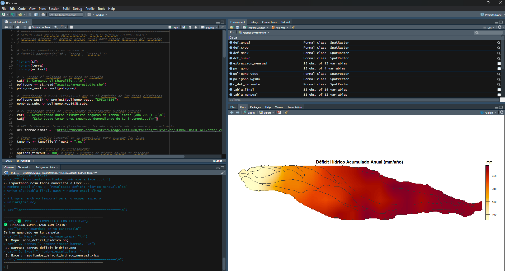
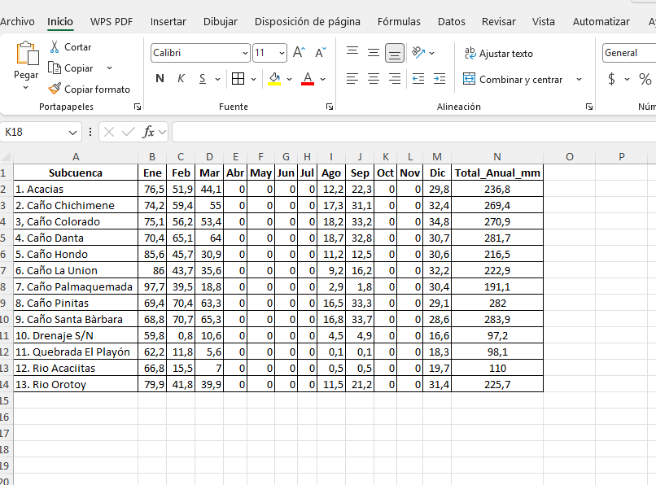

# Déficit Hídrico Mensual por Polígono (TerraClimate) — R

Script en **R** que descarga automáticamente la variable `def` (*Water Deficit*) de **TerraClimate** para el año 2024, la recorta a tus polígonos y entrega mapas, gráfico de barras y un Excel con el déficit hídrico mensual y acumulado anual por polígono.

---

## 1. ¿Qué hace este script?

1. Lee un shapefile desde `input/` (subcuencas, fincas, etc.).
2. Te pregunta qué columna identifica cada polígono (vía diálogo de RStudio o consola).
3. Descarga el NetCDF de **TerraClimate — Water Deficit 2024** desde el servidor THREDDS de la Universidad de California, Merced.
4. Recorta, enmascara y suaviza los datos al polígono (remuestreo bilineal ×20).
5. Calcula el **déficit promedio mensual** por polígono y el **acumulado anual**.
6. Genera un mapa anual, un gráfico de barras y un Excel de resultados.

---

## 2. Fuente de información: TerraClimate (`def`)

**TerraClimate** es un dataset mensual de variables climáticas y de balance hídrico superficial para todas las áreas terrestres del mundo.

| Característica | Valor |
|---|---|
| Institución | **Climatology Lab** — Universidad de California, Merced |
| Resolución espacial | 1/24° (~4 km × 4 km) |
| Cobertura geográfica | Global (superficies terrestres) |
| Serie temporal | Desde 1958 hasta el presente (actualización anual) |
| Variable procesada | `def` — **Climate Water Deficit** |
| Unidades | mm/mes |
| Tipo de dato | Modelo de balance hídrico que combina WorldClim + CRU Ts4.0 + reanálisis JRA-55 |
| Año descargado | **2024** (configurable en el script) |
| Fuente NetCDF | `http://thredds.northwestknowledge.net:8080/thredds/fileServer/TERRACLIMATE_ALL/data/TerraClimate_def_2024.nc` |

### ¿Qué es el *déficit hídrico*?

El déficit hídrico (`def = PET − AET`) es la diferencia entre la **evapotranspiración potencial** (la que ocurriría si hubiera agua ilimitada) y la **evapotranspiración real**. Es un indicador clave de **estrés hídrico y sequía agrícola**: cuanto mayor el `def`, mayor la demanda de agua no satisfecha por el suelo.

**Más información:** <https://www.climatologylab.org/terraclimate.html>

---

## 3. Requisitos previos

- **R 4.2 o superior**.
- **RStudio** (muy recomendado: el script usa `rstudioapi::showPrompt` para el diálogo interactivo).
- Paquetes R: `sf`, `terra`, `writexl`.
- Un **shapefile** con los polígonos (cualquier CRS, el script reproyecta a EPSG:4326).
- Conexión a internet (el NetCDF pesa ~70 MB).

---

## 4. Estructura del proyecto

```
deficit_hidrico_terraclimate/
├── decifit_hidrico.R           ← script principal
├── README.md
├── input/                      ← TÚ colocas aquí tu shapefile
└── output/                     ← se crea automáticamente
```

---

## 5. Instalación paso a paso

**Paso 1. Abre el proyecto en RStudio.**

Ve a `File → Open Project...` o simplemente abre `decifit_hidrico.R`. Asegúrate de que el **Working Directory** esté en la carpeta del proyecto:
```r
setwd("ruta/a/deficit_hidrico_terraclimate")
# o en RStudio: Session → Set Working Directory → To Source File Location
```

**Paso 2. Instala los paquetes (solo la primera vez):**

```r
install.packages(c("sf", "terra", "writexl"))
```

> 💡 `terra` requiere GDAL. En Windows normalmente se instala sin problemas; en Linux/Mac puede necesitar `gdal-dev`.

---

## 6. Cómo usar el script (paso a paso)

### Paso 1 — Coloca tu shapefile en `input/`

Los 4 archivos (`.shp`, `.shx`, `.dbf`, `.prj`).

### Paso 2 — (Opcional) Fija la columna ID sin diálogo

Abre `decifit_hidrico.R` y cambia:
```r
COL_ID <- NULL          # → te preguntará
# COL_ID <- "NOMBRE"    # → usa directamente esa columna
```

### Paso 3 — Ejecuta el script

En RStudio pulsa **Source** (Ctrl+Shift+S) o selecciona todo y pulsa **Run**.

### Paso 4 — Responde el diálogo

Se abre un cuadro de diálogo con las columnas disponibles:



Escribe el **nombre** o el **número** de la columna que identifica cada polígono.

### Paso 5 — Observa la consola

```
1. Cargando el shapefile desde input/...
2. Descargando datos climáticos de TerraClimate (déficit, año 2024)...
3. Preparando capas mensuales...
4. Recortando y suavizando los datos al polígono...
5. Calculando el déficit mensual por polígono...
6. Generando gráficos (300 DPI)...
7. Exportando resultados a Excel...

PROCESO COMPLETADO
```

### Paso 6 — Revisa `output/`

---

## 7. Archivos generados (`output/`)

| Archivo | Descripción |
|---|---|
| `mapa_deficit_hidrico.png` | Mapa de calor con déficit hídrico acumulado anual (mm/año) |
| `barras_deficit_hidrico.png` | Gráfico de barras del promedio regional mensual |
| `resultados_deficit_hidrico_mensual.xlsx` | Excel con columnas: ID, Ene–Dic, Total_Anual_mm |

Ejemplo del Excel generado:



---

## 8. Cambiar el año de análisis

Abre `decifit_hidrico.R` y busca la línea:
```r
url_terraclimate <- "http://thredds.northwestknowledge.net:8080/thredds/fileServer/TERRACLIMATE_ALL/data/TerraClimate_def_2024.nc"
```
Reemplaza `2024` por el año deseado (TerraClimate está disponible desde 1958).

---

## 9. Solución de problemas

| Problema | Causa / Solución |
|---|---|
| `No se encontró ningún .shp dentro de 'input/'` | Copia los 4 archivos del shapefile a `input/` |
| `Error in download.file(...)` | El servidor THREDDS puede estar caído; reintenta más tarde |
| Timeout en la descarga | Aumenta `options(timeout = 600)` al inicio del script |
| El diálogo no aparece | Estás ejecutando fuera de RStudio; responde por consola con `readline()` |
| Valores `NaN` en algún polígono | Polígono fuera de cobertura terrestre (ej: sobre el mar) |
| `terra` no se instala | Instala GDAL: Ubuntu `sudo apt install libgdal-dev`; Mac `brew install gdal` |
